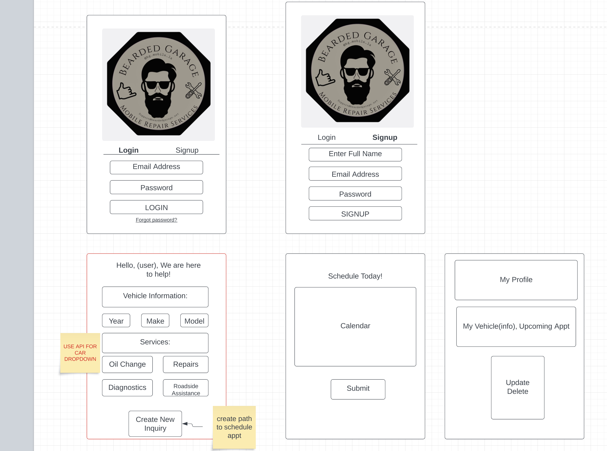

# Bearded Garage Mobile Services

<!--Table of Contents-->
Table of Contents
<ol>
 <li>
  <a href= "#Bearded Garage">Bearded Garage Mobile Services App</a>
  <ul>
   <li><a href="#Built-with">Built With</a></li>
  </ul>
 
 </li>
 <li>
  <a href="#installation-instructions">Installation Instructions</a></li>
<li><a href="#wire-frame">Wire Frames</a></li>  
</ol>

<!--About the Project-->
# Bearded Garage

Bearded Garage Mobile Services App is an app that allows users to create(schedule) a vehicle service. Users are asked to select vehicle year, make, model and service request. Users are able to select an available time and day to schedule the vehicle service. In their profile page, users are able to see their vehicle information and appoinment date/time. Users are able to create, update/edit or delete any information on their profile.

### Built With
This is a full-stack app built using Javascript and React for the frontend and Python and Django for the backend. It offers full CRUD capabilities that allows users to create, update or delete data. 

(<a href="#top">back to top</a>)

### Approach Taken

### Installation
Users will be able to go to this site () and begin to schedule services for their vehicle(s).

(<a href="#top">back to top</a>)

### Wireframes

